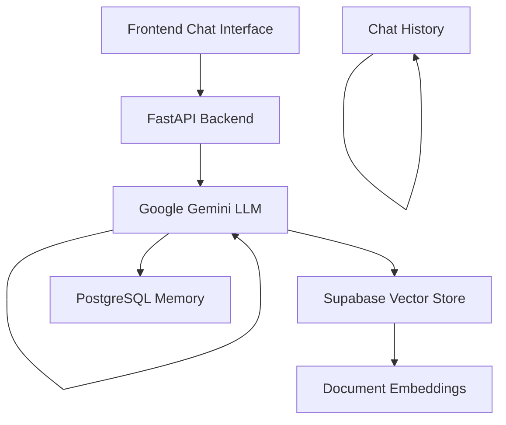

# 🤖 Aizonix Solutions - Document-Based Chatbot Platform

An intelligent document-based chatbot system that helps organizations manage FAQs, compliance documents, company policies, and regulatory information through conversational AI. Built with n8n workflows, FastAPI backend, and modern web technologies.

## ✨ Features

- **🧠 Intelligent Document Processing**: RAG (Retrieval-Augmented Generation) system for accurate document-based responses
- **💬 Real-time Chat Interface**: Modern, responsive web interface with typing indicators and message history
- **🔄 n8n Workflow Integration**: Powerful automation workflows for chat processing and document management
- **🗄️ Vector Database**: Supabase/PostgreSQL with vector embeddings for semantic search
- **🧠 Memory Management**: Persistent conversation memory across sessions
- **📱 Mobile Responsive**: Works seamlessly on desktop and mobile devices
- **🔌 API-First Design**: RESTful API with comprehensive documentation

## 🏗️ Architecture



## 🛠️ Tech Stack

### Backend
- **FastAPI** - High-performance Python web framework
- **n8n** - Workflow automation and orchestration
- **LangChain** - AI/ML framework for LLM applications
- **Google Gemini** - Large Language Model for chat responses
- **Supabase** - Vector database for document embeddings
- **PostgreSQL** - Conversation memory and data persistence

### Frontend
- **Vanilla JavaScript** - Modern ES6+ with no framework dependencies
- **CSS3** - Custom animations and responsive design
- **HTML5** - Semantic markup and accessibility

### AI/ML Components
- **RAG (Retrieval-Augmented Generation)** - Document-based question answering
- **Vector Embeddings** - Google Gemini embeddings for semantic search
- **Text Splitting** - Recursive character text splitter for optimal chunking
- **Memory Management** - Persistent chat memory across sessions

## 🚀 Quick Start

### Prerequisites
- Python 3.8+
- n8n instance (self-hosted or cloud)
- Supabase account
- Google AI/Gemini API key
- PostgreSQL database

### Installation

1. **Clone the repository**
```bash
git clone https://github.com/yourusername/aizonix-solutions.git
cd aizonix-solutions
```

2. **Install Python dependencies**
```bash
pip install fastapi uvicorn httpx pydantic
```

3. **Set up environment variables**
```bash
export N8N_WEBHOOK_URL="your-n8n-webhook-url"
export GOOGLE_API_KEY="your-google-gemini-api-key"
export SUPABASE_URL="your-supabase-url"
export SUPABASE_API_KEY="your-supabase-api-key"
export POSTGRES_CONNECTION="your-postgres-connection-string"
```

4. **Import n8n workflow**
- Import the `RAG_Comp.json` file into your n8n instance
- Configure your credentials (Google Gemini, Supabase, PostgreSQL)
- Update webhook URL in `main.py`

5. **Prepare static files**
```bash
mkdir static
cp index.html static/
```

6. **Run the application**
```bash
python main.py
```

7. **Access the application**
- Open http://localhost:8000 in your browser
- Start chatting with your document-based AI assistant!

## 📊 API Endpoints

### Chat Endpoint
```http
POST /chat
Content-Type: application/json

{
  "message": "What services do you offer?",
  "sessionId": "optional-session-id"
}
```

**Response:**
```json
{
  "response": "We offer document-based chatbot development...",
  "status": "success",
  "timestamp": "2024-01-15T10:30:00Z"
}
```

### Health Check
```http
GET /health
```

**Response:**
```json
{
  "status": "healthy",
  "n8n_status": "online",
  "webhook_url": "http://your-n8n-instance/webhook/..."
}
```

### API Documentation
```http
GET /api/docs
```

## 🔧 Configuration

### n8n Workflow Configuration

The workflow consists of several key components:

1. **Chat Trigger** - Receives messages from the FastAPI backend
2. **AI Agent** - Orchestrates the conversation flow using LangChain
3. **Google Gemini LLM** - Provides intelligent responses
4. **Vector Store** - Retrieves relevant document chunks
5. **Memory Management** - Maintains conversation context
6. **Document Loader** - Processes and embeds documents

### Environment Variables

| Variable | Description | Required |
|----------|-------------|----------|
| `N8N_WEBHOOK_URL` | Your n8n webhook endpoint | ✅ |
| `GOOGLE_API_KEY` | Google Gemini API key | ✅ |
| `SUPABASE_URL` | Supabase project URL | ✅ |
| `SUPABASE_API_KEY` | Supabase API key | ✅ |
| `POSTGRES_CONNECTION` | PostgreSQL connection string | ✅ |

## 📄 Document Management

### Adding Documents

1. **Upload via n8n workflow**:
   - Use the manual trigger in the workflow
   - Documents are automatically processed and embedded
   - Stored in Supabase vector database

2. **Supported formats**:
   - PDF documents
   - Text files
   - Word documents (with additional configuration)

3. **Processing pipeline**:
   - Document download/upload
   - Text extraction
   - Chunking with recursive character splitter
   - Embedding generation with Google Gemini
   - Storage in Supabase vector store

## 🎨 Frontend Features

### Chat Interface
- **Modern Design**: Glass-morphism UI with gradient backgrounds
- **Responsive Layout**: Works on all screen sizes
- **Real-time Indicators**: Typing indicators and connection status
- **Message Formatting**: Support for markdown-style formatting
- **Quick Questions**: Pre-defined questions for common queries
- **Error Handling**: Graceful error messages and retry mechanisms

### Animations
- **Smooth Transitions**: CSS3 animations for message appearances
- **Loading States**: Typing indicators with animated dots
- **Interactive Elements**: Hover effects and button animations
- **Status Indicators**: Real-time connection and health monitoring

## 🔐 Security Considerations

- **API Validation**: Input sanitization and validation
- **CORS Configuration**: Properly configured cross-origin requests
- **Rate Limiting**: Implement rate limiting for production use
- **Environment Variables**: Sensitive data stored in environment variables
- **Session Management**: Secure session handling with unique IDs

## 📈 Performance Optimization

- **Async Operations**: FastAPI with async/await for non-blocking operations
- **Connection Pooling**: Efficient database connection management
- **Caching**: Vector search result caching for common queries
- **Lazy Loading**: Progressive message loading for large conversations
- **Error Recovery**: Automatic retry mechanisms for failed requests

## 🧪 Testing

### Manual Testing
1. Start the application
2. Send various types of questions
3. Test document retrieval accuracy
4. Verify conversation memory
5. Check error handling

### API Testing
```bash
# Health check
curl http://localhost:8000/health

# Send chat message
curl -X POST http://localhost:8000/chat \
  -H "Content-Type: application/json" \
  -d '{"message": "What services do you offer?", "sessionId": "test-session"}'
```

## 🚀 Deployment

### Production Deployment

1. **Backend Deployment**:
   - Deploy FastAPI with Gunicorn/Uvicorn
   - Use environment variables for configuration
   - Set up proper logging and monitoring

2. **n8n Deployment**:
   - Use n8n cloud or self-hosted instance
   - Configure proper security and access controls
   - Set up monitoring and alerting

3. **Database Setup**:
   - Use managed PostgreSQL service
   - Configure Supabase for vector operations
   - Set up proper backups and monitoring

### Docker Deployment

```dockerfile
FROM python:3.9-slim

WORKDIR /app
COPY requirements.txt .
RUN pip install -r requirements.txt

COPY . .
EXPOSE 8000

CMD ["uvicorn", "main:app", "--host", "0.0.0.0", "--port", "8000"]
```

## 🤝 Contributing

We welcome contributions! Please follow these steps:

1. Fork the repository
2. Create a feature branch (`git checkout -b feature/amazing-feature`)
3. Commit your changes (`git commit -m 'Add some amazing feature'`)
4. Push to the branch (`git push origin feature/amazing-feature`)
5. Open a Pull Request

### Development Guidelines
- Follow PEP 8 for Python code
- Add docstrings for functions and classes
- Include tests for new features
- Update documentation as needed

## 📝 License

This project is licensed under the MIT License - see the [LICENSE](LICENSE) file for details.

## 🙏 Acknowledgments

- **LangChain** - For the powerful AI framework
- **n8n** - For workflow automation capabilities
- **FastAPI** - For the excellent web framework
- **Google Gemini** - For AI/ML capabilities
- **Supabase** - For vector database functionality

## 📞 Support

For support and questions:

- 📧 Email: support@aizonix.com
- 💬 GitHub Issues: [Create an issue](https://github.com/yourusername/aizonix-solutions/issues)
- 📖 Documentation: [View full docs](https://docs.aizonix.com)

## 🗺️ Roadmap

- [ ] **Multi-language Support**: Support for multiple languages
- [ ] **Advanced Analytics**: Usage analytics and insights dashboard
- [ ] **Custom Integrations**: Slack, Teams, WhatsApp integrations
- [ ] **Voice Support**: Speech-to-text and text-to-speech capabilities
- [ ] **Advanced Security**: OAuth, SSO, and enterprise security features
- [ ] **Performance Monitoring**: Detailed performance metrics and monitoring
- [ ] **A/B Testing**: Built-in A/B testing for conversation flows

---

**Built with ❤️ by the Aizonix Solutions Team**
